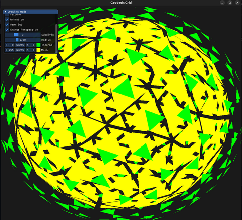

# Icosphere implementation
OpenGL v3.0 is used to render an Icosphere with selected number of face subdivisions
Geometry Shader is used to create an explosion-like effect in which the central face 
of each parent face subdivision is displaced proportionally towards its outward normal vector

# Features
- Quaternion Camera
- Change Color
- Enable/Disable fill
- Enable/Disable texture (predefined)
- Enable/Disable face subdivision
- Enable/Disable animation
- Change radius 

# Build & Run
Use `make all` and `./Source` to build and run the application respectively
and `make clean` to clean the binaries.

# Demo
For a short demonstration take a look at geodesic.mkv video

# Samples

  

  

 
